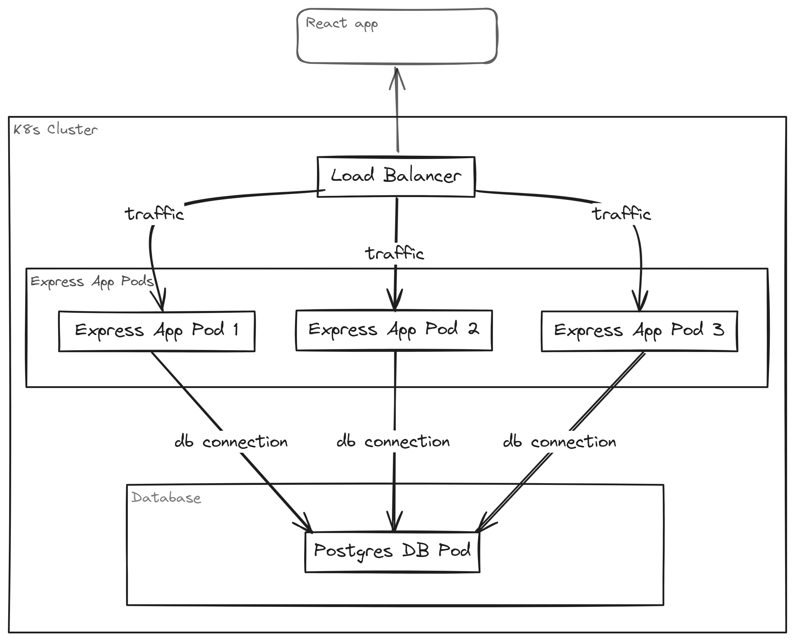
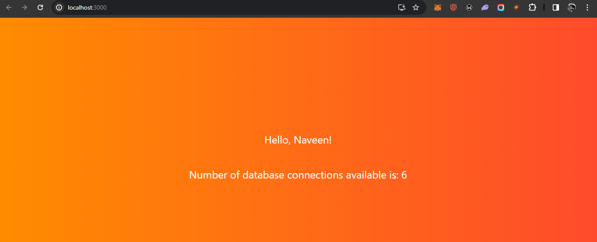

# PostgreSQL-Express Connection Monitor

[](https://opensource.org/licenses/MIT)

## Overview

This project combines PostgreSQL as the database, Express.js as the Node.js application framework, and React for the frontend. The primary functionality involves querying the PostgreSQL database to fetch the number of available connections and exposing this information through a REST API endpoint "/connections". The React app then displays this dynamic connection count, providing a real-time overview of the database's connection status. Easily monitor and manage your PostgreSQL database connections with this intuitive and responsive web application.

## Prerequisites
```
Node.js and npm
Express.js: `npm install express`
CORS Middleware
Axios (HTTP client for React)
PostgreSQL Database Connection Details
```
(Local-Setup)
```
Docker Desktop
K8s
kubectl `winget install kubectl`
```
# Installation

## Clone the repository
```
git clone https://github.com/NaveeN-929/connection-monitor
cd connection-monitor
```

## Set-up React app
```
cd /react-monitor
npm install
npm start
```
### verify react app
http://localhost:3000


## k8s architecture


## Set-up Postgres DB container
```
cd ~
kubectl apply -f postgres.yml
kubectl get pods -n default
kubectl get services -n default : note the IP address of the postgress
```
## Set-up Express app
```
cd /fetch-con

edit "app.js" file for PostgreSQL connection details section
     under  host: <paste the postgress IP >
```

## Build the Docker image
```
docker login
docker build . -f Dockerfile -t repo-name/image-name:tag
docker push repo-name/image-name:tage
```
## create the k8s pods
```
kubectl apply -f express-app.yml
kubectl get pods -n default
```
### verify express app
http://localhost/connections

### verify react app
http://localhost:3000



## Terminate the created resources
```
kubectl delete -f <file-name.yml>
```
